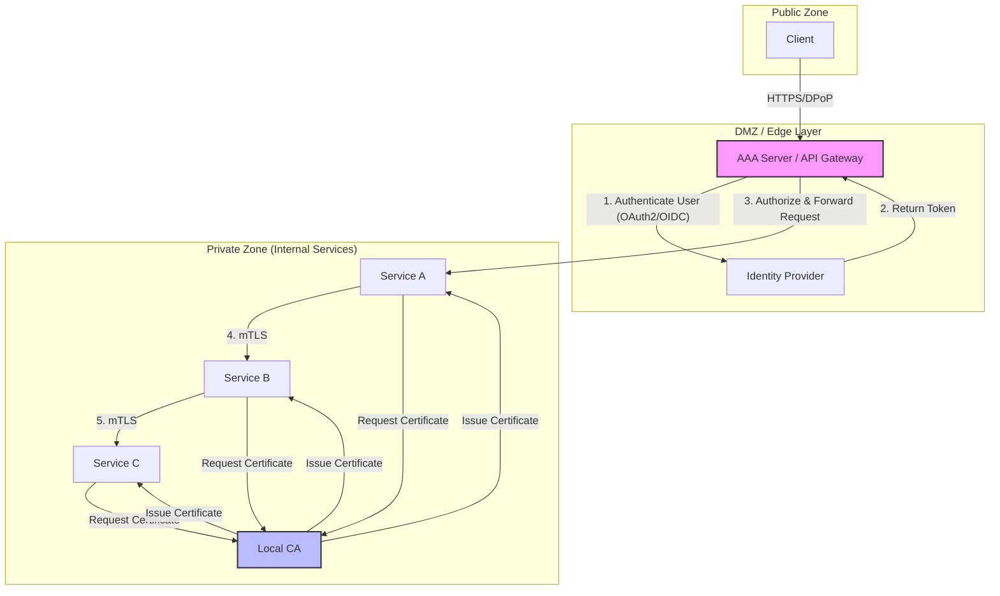

# Đề xuất 4: Kiến trúc Zero Trust với AAA Server và Local CA

## 1. Đặt vấn đề

Trong các kiến trúc hiện đại, đặc biệt là kiến trúc microservices, việc xác thực và ủy quyền không chỉ dừng lại ở vành đai (perimeter) của hệ thống. Các mô hình bảo mật truyền thống dựa trên "tin tưởng trong mạng nội bộ" đã không còn hiệu quả khi các dịch vụ nội bộ (internal services) giao tiếp với nhau. Nếu một kẻ tấn công xâm nhập được vào mạng nội bộ, chúng có thể dễ dàng di chuyển ngang (lateral movement) và truy cập vào các dịchvụ khác mà không gặp nhiều rào cản.

Thêm vào đó, việc quản lý danh tính và quyền truy cập của người dùng (end-user) và các dịch vụ một cách nhất quán và tập trung là một thách thức lớn.

**Bài toán cần giải quyết:**

1.  **Xác thực mọi yêu cầu:** Làm thế nào để đảm bảo mọi yêu cầu, dù đến từ bên ngoài (public) hay từ trong mạng nội bộ (internal), đều được xác thực một cách mạnh mẽ?
2.  **Phân quyền chi tiết (Fine-grained Authorization):** Làm thế nào để thực thi các chính sách phân quyền chi tiết cho từng yêu cầu, đảm bảo nguyên tắc đặc quyền tối thiểu (Principle of Least Privilege)?
3.  **Bảo mật giao tiếp giữa các microservices:** Làm thế nào để các microservices có thể giao tiếp với nhau một cách an toàn, xác thực lẫn nhau và mã hóa dữ liệu truyền đi?
4.  **Quản lý tập trung và kiểm toán (Accounting):** Làm thế nào để có một nơi tập trung cho việc quản lý chính sách, xác thực, và ghi lại (log) toàn bộ các hoạt động truy cập để phục vụ cho việc kiểm toán và điều tra?

Để giải quyết các vấn đề trên, đề xuất này đưa ra một kiến trúc Zero Trust sử dụng **AAA Server** cho việc xác thực, ủy quyền và kiểm toán tập trung, kết hợp với **Local Certificate Authority (CA)** để thiết lập xác thực lẫn nhau (mTLS) cho các dịch vụ nội bộ.

## 2. Kiến trúc đề xuất

Kiến trúc này chia việc bảo mật thành hai lớp chính:

1.  **Lớp biên (Edge Layer):** Nơi AAA Server tiếp nhận, xác thực và ủy quyền cho tất cả các yêu cầu từ client bên ngoài.
2.  **Lớp dịch vụ (Service Layer):** Nơi các microservices giao tiếp với nhau một cách an toàn thông qua mTLS, sử dụng chứng chỉ được cấp bởi một Local CA.

### 2.1. Sơ đồ kiến trúc tổng quan

### 2.2. Luồng hoạt động

Xem chi tiết tại: [Authentication Flow](./diagram/Propose4_Authentication_Flow.md)

1.  **Client Authentication:**
    *   Client gửi yêu cầu truy cập tài nguyên đến AAA Server, kèm theo thông tin xác thực (ví dụ: Access Token theo chuẩn JWT).
    *   AAA Server (đóng vai trò là API Gateway) xác thực token này với Identity Provider (IdP). Nó kiểm tra tính hợp lệ, chữ ký, và thời gian hết hạn của token.
2.  **Authorization:**
    *   Sau khi xác thực thành công, AAA Server thực hiện ủy quyền. Dựa vào các thông tin trong token (như `scopes`, `roles`, `claims`), nó quyết định xem yêu cầu có được phép truy cập vào service nội bộ hay không.
3.  **Request Forwarding:**
    *   Nếu yêu cầu hợp lệ, AAA Server sẽ chuyển tiếp (forward) yêu cầu đến microservice tương ứng (ví dụ: Service A).
4.  **Internal Communication (mTLS):**
    *   Khi Service A cần gọi đến Service B, chúng sẽ thiết lập một kết nối mTLS.
    *   Cả hai service sẽ trình bày chứng chỉ (certificate) của mình, được cấp bởi Local CA.
    *   Chúng sẽ kiểm tra chứng chỉ của nhau dựa trên CA chung mà cả hai cùng tin tưởng. Quá trình này đảm bảo rằng chỉ các service hợp lệ, có chứng chỉ do Local CA cấp, mới có thể giao tiếp với nhau.
    *   Toàn bộ dữ liệu truyền đi giữa hai service sẽ được mã hóa.

### 2.3. Công nghệ đề xuất

*   **AAA Server:**
    *   **API Gateway:** Sử dụng các giải pháp mạnh như **Kong**, **Tyk**, hoặc **AWS API Gateway**. Các gateway này hỗ trợ OIDC/OAuth2, rate limiting, logging, và có thể mở rộng bằng các plugin tùy chỉnh.
    *   **Identity Provider (IdP):** Sử dụng **Keycloak**, **Okta**, **Auth0**, hoặc **AWS Cognito** để quản lý danh tính người dùng, cấp và xác thực token.
*   **Local Certificate Authority (CA):**
    *   **HashiCorp Vault:** Một giải pháp mạnh mẽ để quản lý bí mật và có thể hoạt động như một CA động (dynamic CA), tự động cấp và thu hồi chứng chỉ với vòng đời ngắn.
    *   **step-ca:** Một giải pháp mã nguồn mở nhẹ nhàng hơn, chuyên cho việc vận hành một private CA.
    *   **Tự xây dựng (dùng cho PoC):** Có thể sử dụng OpenSSL để tạo một CA đơn giản cho mục đích thử nghiệm.
*   **Service Mesh (Tùy chọn nhưng khuyến khích):**
    *   Để đơn giản hóa việc triển khai mTLS, có thể sử dụng một service mesh như **Istio** hoặc **Linkerd**. Service mesh sẽ tự động hóa việc cấp phát, xoay vòng (rotate) chứng chỉ và cấu hình mTLS cho các sidecar proxy, giúp các lập trình viên không cần quan tâm đến logic này trong code ứng dụng.

## 3. Mô phỏng thực nghiệm (Proof of Concept)

Để chứng minh tính khả thi của kiến trúc, chúng ta có thể xây dựng một hệ thống PoC với các bước sau:

1.  **Thiết lập Local CA:**
    *   Sử dụng `openssl` để tạo một Root CA.
    *   Tạo các chứng chỉ và private key cho 2 microservices (ví dụ: `service-a` và `service-b`).

2.  **Xây dựng các Microservices:**
    *   Viết 2 API đơn giản bằng Python (FastAPI/Flask).
    *   `service-a`: Có một endpoint public (ví dụ: `/`) và một endpoint gọi sang `service-b` (ví dụ: `/call-b`).
    *   `service-b`: Có một endpoint internal (ví dụ: `/data`) chỉ có thể được gọi bởi các service khác trong mạng.
    *   Cấu hình web server (như Uvicorn/Gunicorn) của cả hai service để yêu cầu và xác thực chứng chỉ của client (mTLS).

3.  **Thiết lập AAA Server và IdP:**
    *   Triển khai **Keycloak** qua Docker. Tạo một realm, một client, và một user.
    *   Triển khai **Kong API Gateway** qua Docker.
    *   Cấu hình Kong để bảo vệ endpoint `/` của `service-a` bằng OIDC, kết nối đến Keycloak.

4.  **Thực hiện kiểm thử:**
    *   **Kịch bản 1 (Thành công):**
        1.  Client lấy JWT từ Keycloak.
        2.  Client dùng JWT này để gọi đến endpoint `/call-b` trên `service-a` thông qua Kong.
        3.  Kong xác thực JWT, cho phép request đi tiếp.
        4.  `service-a` nhận request, sau đó gọi đến endpoint `/data` của `service-b` qua mTLS.
        5.  `service-b` xác thực chứng chỉ của `service-a`, xử lý và trả về kết quả.
        6.  Toàn bộ chuỗi request thành công.
    *   **Kịch bản 2 (Thất bại - Giao tiếp nội bộ không có mTLS):**
        1.  Thử dùng `curl` từ một container bất kỳ trong cùng mạng Docker để gọi trực tiếp đến `service-b`.
        2.  Request sẽ bị từ chối vì không có chứng chỉ hợp lệ.
    *   **Kịch bản 3 (Thất bại - Truy cập không có token):**
        1.  Thử dùng `curl` gọi trực tiếp đến `service-a` qua Kong mà không có JWT.
        2.  Kong sẽ trả về lỗi `401 Unauthorized`.

## 4. Phân tích Mô hình đe dọa

Kiến trúc này giúp giảm thiểu các rủi ro sau:

*   **Giả mạo dịch vụ (Service Spoofing):** Kẻ tấn công không thể giả mạo một service nội bộ vì không có chứng chỉ hợp lệ được cấp bởi Local CA.
*   **Nghe lén trên mạng nội bộ (Internal Network Sniffing):** Toàn bộ giao tiếp giữa các service đều được mã hóa bằng mTLS, do đó kẻ tấn công không thể đọc được nội dung gói tin.
*   **Di chuyển ngang (Lateral Movement):** Nếu một service bị chiếm quyền, kẻ tấn công cũng không thể dễ dàng gọi sang các service khác vì mỗi service có thể được cấu hình để chỉ tin tưởng một số service nhất định (dựa trên thông tin trong chứng chỉ như Common Name).
*   **Truy cập trái phép từ bên ngoài:** Mọi yêu cầu đều phải qua cửa AAA Server, đảm bảo chỉ những người dùng đã được xác thực và ủy quyền mới có thể truy cập hệ thống.

## 5. Kết luận

Kiến trúc Zero Trust với AAA Server và Local CA cung cấp một mô hình bảo mật mạnh mẽ, toàn diện cho các hệ thống microservices. Nó giải quyết được các bài toán cốt lõi về xác thực, phân quyền, và bảo mật giao tiếp nội bộ, đồng thời tăng cường khả năng quản lý và kiểm toán. Mặc dù việc triển khai ban đầu có thể phức tạp, lợi ích về an ninh và khả năng mở rộng trong dài hạn là rất lớn.
