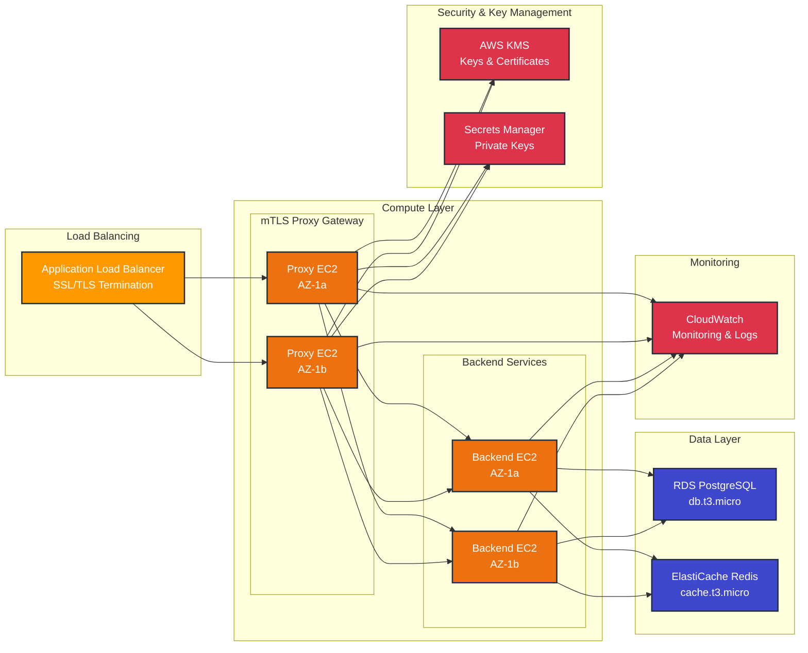

# AWS Architecture

```mermaid
graph LR
    subgraph "Load Balancing"
        ALB[Application Load Balancer<br/>SSL/TLS Termination]
    end
    
    subgraph "Compute Layer"
        subgraph "mTLS Proxy Gateway"
            P1[Proxy EC2<br/>AZ-1a]
            P2[Proxy EC2<br/>AZ-1b]
        end
        
        subgraph "Backend Services"
            B1[Backend EC2<br/>AZ-1a]
            B2[Backend EC2<br/>AZ-1b]
        end
    end
    
    subgraph "Security & Key Management"
        KMS[AWS KMS<br/>Keys & Certificates]
        SM[Secrets Manager<br/>Private Keys]
    end
    
    subgraph "Data Layer"
        RDS[RDS PostgreSQL<br/>db.t3.micro]
        REDIS[ElastiCache Redis<br/>cache.t3.micro]
    end
    
    subgraph "Monitoring"
        CW[CloudWatch<br/>Monitoring & Logs]
    end
    
    ALB --> P1
    ALB --> P2
    
    P1 --> B1
    P1 --> B2
    P2 --> B1
    P2 --> B2
    
    P1 --> KMS
    P1 --> SM
    P2 --> KMS
    P2 --> SM
    
    B1 --> RDS
    B1 --> REDIS
    B2 --> RDS
    B2 --> REDIS
    
    P1 --> CW
    P2 --> CW
    B1 --> CW
    B2 --> CW
    
    classDef aws fill:#FF9900,stroke:#232F3E,stroke-width:2px,color:#fff
    classDef compute fill:#EC7211,stroke:#232F3E,stroke-width:2px,color:#fff
    classDef data fill:#3F48CC,stroke:#232F3E,stroke-width:2px,color:#fff
    classDef security fill:#DD344C,stroke:#232F3E,stroke-width:2px,color:#fff
    
    class ALB aws
    class P1,P2,B1,B2 compute
    class RDS,REDIS data
    class KMS,SM,CW security
```