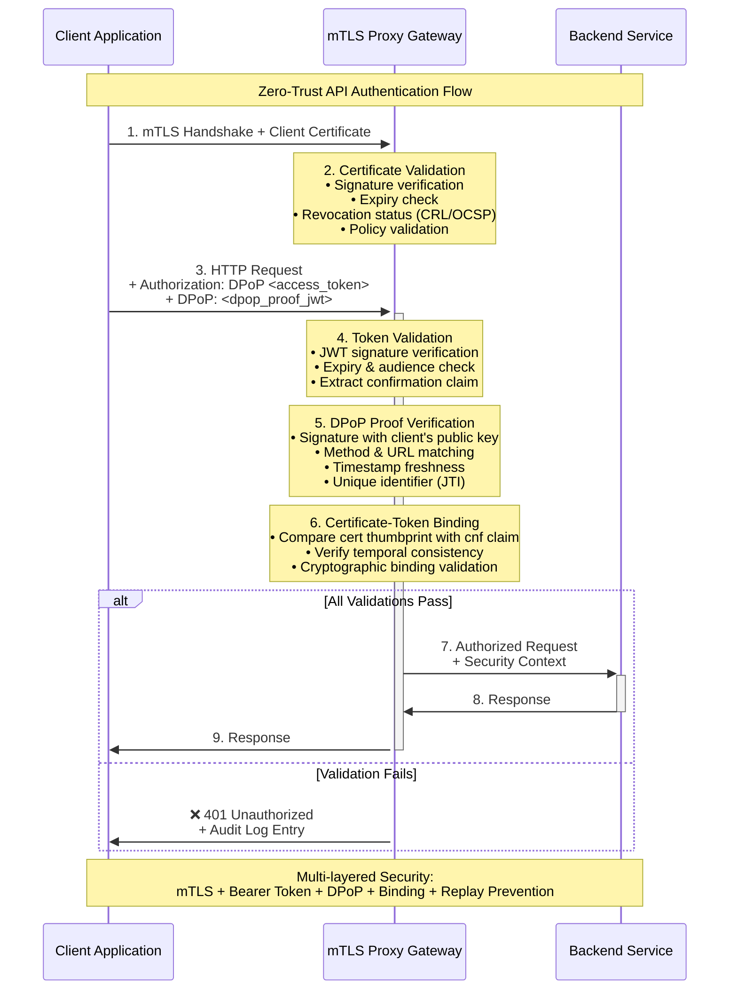

# mTLS Authentication Flow

```mermaid
sequenceDiagram
    participant Client as Client Application
    participant Proxy as mTLS Proxy Gateway
    participant Backend as Backend Service
    
    Note over Client,Backend: Zero-Trust API Authentication Flow
    
    Client->>+Proxy: 1. mTLS Handshake + Client Certificate
    Note over Proxy: 2. Certificate Validation<br/>• Signature verification<br/>• Expiry check<br/>• Revocation status (CRL/OCSP)<br/>• Policy validation
    
    Client->>+Proxy: 3. HTTP Request<br/>+ Authorization: DPoP <access_token><br/>+ DPoP: <dpop_proof_jwt>
    
    Note over Proxy: 4. Token Validation<br/>• JWT signature verification<br/>• Expiry & audience check<br/>• Extract confirmation claim
    
    Note over Proxy: 5. DPoP Proof Verification<br/>• Signature with client's public key<br/>• Method & URL matching<br/>• Timestamp freshness<br/>• Unique identifier (JTI)
    
    Note over Proxy: 6. Certificate-Token Binding<br/>• Compare cert thumbprint with cnf claim<br/>• Verify temporal consistency<br/>• Cryptographic binding validation
    
    alt All Validations Pass
        Proxy->>+Backend: 7. Authorized Request<br/>+ Security Context
        Backend->>-Proxy: 8. Response
        Proxy->>-Client: 9. Response
    else Validation Fails
        Proxy->>Client: ❌ 401 Unauthorized<br/>+ Audit Log Entry
    end
    
    Note over Client,Backend: Multi-layered Security:<br/>mTLS + Bearer Token + DPoP + Binding + Replay Prevention
```