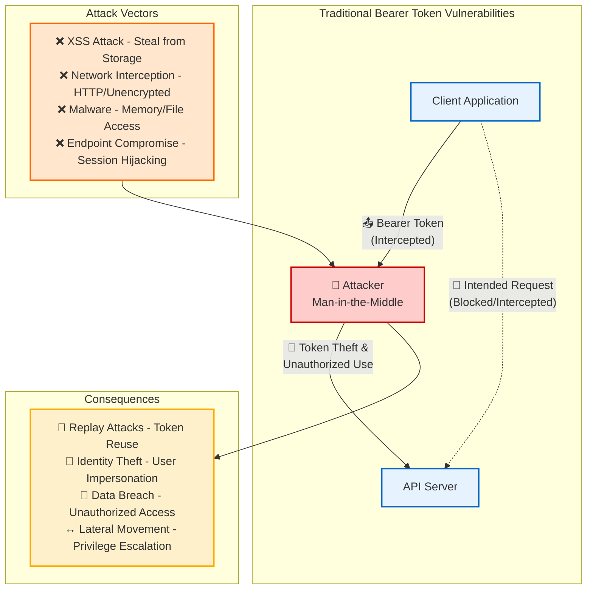
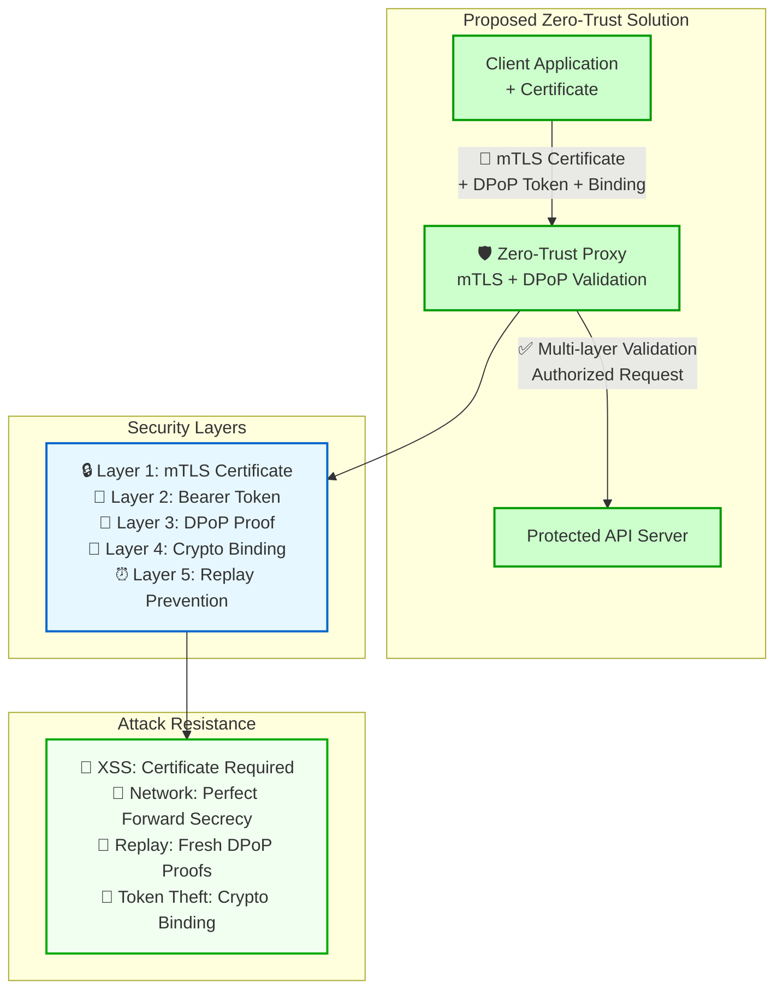

# Bearer Token Threat Model

```mermaid
graph TD
    subgraph "Traditional Bearer Token Vulnerabilities"
        Client[Client Application]
        Attacker[🔴 Attacker<br/>Man-in-the-Middle]
        Server[API Server]
        
        Client -->|"📤 Bearer Token<br/>(Intercepted)"| Attacker
        Attacker -->|"🚨 Token Theft &<br/>Unauthorized Use"| Server
        Client -.->|"💙 Intended Request<br/>(Blocked/Intercepted)"| Server
    end
    
    subgraph "Attack Vectors"
        AttackList["❌ XSS Attack - Steal from Storage<br/>❌ Network Interception - HTTP/Unencrypted<br/>❌ Malware - Memory/File Access<br/>❌ Endpoint Compromise - Session Hijacking"]
    end
    
    subgraph "Consequences"
        ConsequenceList["🔄 Replay Attacks - Token Reuse<br/>👤 Identity Theft - User Impersonation<br/>💾 Data Breach - Unauthorized Access<br/>↔️ Lateral Movement - Privilege Escalation"]
    end
    
    AttackList --> Attacker
    Attacker --> ConsequenceList
    
    classDef threat fill:#ffcccc,stroke:#cc0000,stroke-width:2px
    classDef attack fill:#ffe6cc,stroke:#ff6600,stroke-width:2px
    classDef consequence fill:#fff0cc,stroke:#ffaa00,stroke-width:2px
    classDef normal fill:#e6f3ff,stroke:#0066cc,stroke-width:2px
    
    class Attacker threat
    class AttackList attack
    class ConsequenceList consequence
    class Client,Server normal
```

## Zero-Trust Solution Comparison

```mermaid
graph TB
    subgraph "Proposed Zero-Trust Solution"
        ZTClient[Client Application<br/>+ Certificate]
        ZTProxy[🛡️ Zero-Trust Proxy<br/>mTLS + DPoP Validation]
        ZTServer[Protected API Server]
        
        ZTClient -->|"🔐 mTLS Certificate<br/>+ DPoP Token + Binding"| ZTProxy
        ZTProxy -->|"✅ Multi-layer Validation<br/>Authorized Request"| ZTServer
    end
    
    subgraph "Security Layers"
        SecurityList["🔒 Layer 1: mTLS Certificate<br/>🎫 Layer 2: Bearer Token<br/>🔑 Layer 3: DPoP Proof<br/>🔗 Layer 4: Crypto Binding<br/>⏰ Layer 5: Replay Prevention"]
    end
    
    subgraph "Attack Resistance"
        ResistanceList["🚫 XSS: Certificate Required<br/>🚫 Network: Perfect Forward Secrecy<br/>🚫 Replay: Fresh DPoP Proofs<br/>🚫 Token Theft: Crypto Binding"]
    end
    
    ZTProxy --> SecurityList
    SecurityList --> ResistanceList
    
    classDef secure fill:#ccffcc,stroke:#009900,stroke-width:2px
    classDef layer fill:#e6f7ff,stroke:#0066cc,stroke-width:2px
    classDef block fill:#f0fff0,stroke:#00aa00,stroke-width:2px
    
    class ZTClient,ZTProxy,ZTServer secure
    class SecurityList layer
    class ResistanceList block
```