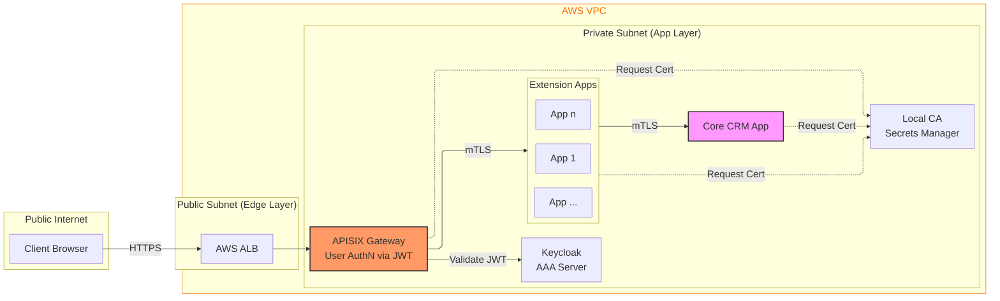

# Đề xuất 4 (v2): Kiến trúc Zero Trust cho Nền tảng CRM Mở rộng (Extensible CRM Platform) trên AWS

## 1. Giới thiệu

Trong bối cảnh phát triển các nền tảng CRM lớn, nhu cầu tùy biến và mở rộng tính năng từ phía khách hàng doanh nghiệp (End-user/Business) là rất lớn. Hệ thống không chỉ cung cấp các tính năng lõi (Core CRM) mà còn cho phép các nhà phát triển (Developers) xây dựng và tích hợp các ứng dụng nghiệp vụ riêng biệt (**Extension Apps**) trực tiếp vào nền tảng.

Thách thức bảo mật đặt ra là: Làm thế nào để cho phép các Extension Apps này hoạt động trong cùng một hạ tầng mạng nội bộ để đảm bảo hiệu năng, nhưng vẫn bảo vệ tuyệt đối an toàn cho **Core CRM**? Core CRM không thể tin tưởng mặc định bất kỳ ứng dụng nào, kể cả khi chúng nằm trong mạng nội bộ.

Đề xuất này trình bày kiến trúc **Zero Trust** áp dụng cho Nền tảng CRM Mở rộng trên AWS. Mục tiêu là thiết lập cơ chế xác thực mạnh mẽ sử dụng **mTLS** cho mọi giao tiếp nội bộ, đảm bảo chỉ những ứng dụng đã được cấp phép mới có quyền truy cập vào dữ liệu lõi.

## 2. Mô tả kiến trúc hệ thống

Hệ thống được thiết kế để phân tách rõ ràng giữa các ứng dụng mở rộng và lõi hệ thống, với cơ chế bảo vệ đa lớp:

### 2.1. Các vùng bảo vệ

*   **Vùng Public (Internet Zone):** Nơi người dùng cuối (Clients/Browsers) truy cập hệ thống.
*   **Vùng Biên (Edge Layer):** Chốt chặn đầu tiên với **AWS ALB** và **Apache APISIX Gateway**.
    *   APISIX chịu trách nhiệm xác thực người dùng (User Authentication) thông qua JWT được cấp bởi Keycloak.
    *   Sau khi xác thực User thành công, APISIX đóng vai trò là một "Trusted Client" để chuyển tiếp request vào mạng nội bộ.
*   **Vùng Ứng dụng Mở rộng (Extension App Zone - Private Subnet):**
    *   Chứa **Extension Apps (Service A):** Các ứng dụng nghiệp vụ riêng biệt do Developer phát triển (ví dụ: App chấm công, App quản lý kho...).
    *   Các Service này nhận request từ APISIX và xử lý logic nghiệp vụ riêng.
*   **Vùng Lõi (Core Zone - Private Subnet):**
    *   Chứa **Core CRM App (Service B):** Trái tim của hệ thống, quản lý dữ liệu Master (Khách hàng, Hợp đồng).
    *   **Đặc biệt:** Core CRM App **không** tích hợp với Keycloak/AAA Server. Nó chỉ tin tưởng vào cơ chế **mTLS**. Nó chỉ chấp nhận kết nối từ các Extension Apps có chứng chỉ hợp lệ.

### 2.2. Tài sản cần bảo vệ

Việc xác định tài sản cần bảo vệ được phân chia theo từng góc nhìn cụ thể trong kiến trúc:

*   **Tổng thể:** Toàn bộ **Dữ liệu doanh nghiệp** và tính toàn vẹn của các **Services** bên trong hệ thống là tài sản tối thượng. Mục tiêu là ngăn chặn rò rỉ dữ liệu và gián đoạn dịch vụ.
*   **Bảo mật ở Vùng Biên (Edge Layer):** **Thông tin đăng nhập (Credentials)** và **Phiên làm việc (User Session/Token)** của người dùng là tài sản cần bảo vệ. Cần ngăn chặn các cuộc tấn công chiếm quyền tài khoản hoặc giả mạo phiên.
*   **Bảo mật ở Vùng Private Subnet (Extension Zone):** **Quyền truy cập vào từng Service** là tài sản. Một Extension App chỉ được phép hoạt động trong phạm vi chức năng của nó, không được phép gọi bừa bãi sang các App khác nếu không được cấp quyền.
*   **Bảo mật ở Vùng Lõi (Core Zone):** **Quyền truy cập và Dữ liệu của Core CRM** là tài sản quan trọng nhất. Đây là "trái tim" của hệ thống, chỉ chấp nhận các kết nối đã được xác thực tuyệt đối (qua mTLS) từ các nguồn tin cậy.

### 2.3. Sơ đồ kiến trúc

Code snippet

## 3. Công nghệ sử dụng

*   **Infrastructure as Code (IaC): Terraform**
    *   Quản lý hạ tầng AWS nhất quán và an toàn.

*   **API Gateway: Apache APISIX**
    *   **Vai trò:** Gateway nhận request từ Client.
    *   **Tính năng:**
        *   Xác thực JWT của User (tích hợp Keycloak).
        *   **mTLS Client:** Cấu hình chứng chỉ Client để xác thực chính nó khi gọi vào Service A.

*   **AAA Server: Keycloak**
    *   **Vai trò:** Đóng vai trò xác thực (authentication), ủy quyền (authorization) người dùng và kiểm toán (accounting) ở lớp biên.

*   **Internal Security: mTLS & Local CA**
    *   **Vai trò:** Cơ chế xác thực và ủy quyền duy nhất trong mạng nội bộ.
    *   **Local CA:** Cấp phát chứng chỉ cho APISIX, Extension Apps và Core CRM App.
    *   **Core CRM App:** Sử dụng mTLS để định danh Extension App. Nếu Extension App có chứng chỉ hợp lệ, Core CRM App cho phép truy cập (Authorization dựa trên Identity của Service).

## 4. Use-cases chi tiết

### 4.1. Tương tác giữa API Gateway và AAA Server (Keycloak)

Hệ thống sử dụng Keycloak làm AAA Server trung tâm tại lớp biên để đảm bảo an ninh cho người dùng cuối (End-user) trước khi traffic đi vào mạng nội bộ.

*   **Authentication (Xác thực):**
    *   **Bước 1:** Client gửi thông tin đăng nhập (username/password) đến Keycloak.
    *   **Bước 2:** Keycloak kiểm tra thông tin trong cơ sở dữ liệu người dùng.
    *   **Bước 3:** Nếu hợp lệ, Keycloak cấp phát **Access Token (JWT)** chứa thông tin định danh (Identity) và các quyền hạn (Claims).

*   **Authorization (Ủy quyền tại biên):**
    *   **Bước 1:** Client gửi request API kèm theo JWT đến APISIX Gateway.
    *   **Bước 2:** APISIX xác thực chữ ký số (Signature) và thời hạn (Expiry) của JWT để đảm bảo token không bị giả mạo.
    *   **Bước 3:** APISIX kiểm tra các Claims trong JWT (ví dụ: `roles`, `scopes`) để quyết định xem User có được phép truy cập vào endpoint đích hay không.

*   **Accounting (Kiểm toán):**
    *   **Bước 1:** Keycloak ghi lại nhật ký các sự kiện quan trọng: Đăng nhập, Đăng xuất, Cấp lại token (Token Refresh).
    *   **Bước 2:** APISIX ghi lại nhật ký truy cập (Access Logs) cho mỗi request, bao gồm: Người thực hiện (User ID từ JWT), Thời gian, Hành động, và Kết quả trả về.

### 4.2. Luồng giao tiếp nội bộ (Internal Communication Flow)

Luồng giao tiếp trong mạng nội bộ (Private Subnet) tuân thủ nghiêm ngặt mô hình Zero Trust sử dụng mTLS, bắt đầu từ khi Gateway chuyển tiếp request vào trong.

*   **Flow 1: Từ API Gateway đến Extension App**
    *   **Bước 1:** Sau khi hoàn tất xác thực AAA cho User, APISIX Gateway đóng vai trò là một Client nội bộ để gọi vào **Extension App**.
    *   **Bước 2:** APISIX sử dụng chứng chỉ **Gateway Certificate** để thiết lập kết nối mTLS với Extension App.
    *   **Bước 3:** Extension App kiểm tra chứng chỉ của APISIX. Nếu chứng chỉ hợp lệ (do Local CA cấp), kết nối được chấp nhận.
    *   **Bước 4:** APISIX chuyển tiếp request nghiệp vụ kèm theo thông tin ngữ cảnh người dùng (User Context) qua Header.

*   **Flow 2: Từ Extension App đến Core CRM App**
    *   **Bước 1:** Trong quá trình xử lý, Extension App cần truy xuất dữ liệu lõi từ **Core CRM App**.
    *   **Bước 2:** Extension App sử dụng chứng chỉ **App Certificate** của mình để khởi tạo kết nối mTLS tới Core CRM App.
    *   **Bước 3:** Core CRM App kiểm tra chứng chỉ của Extension App.
        *   **Thành công:** Nếu chứng chỉ hợp lệ, Core CRM App xác nhận đây là một ứng dụng mở rộng được phép hoạt động trong hệ thống.
        *   **Thất bại:** Nếu không có chứng chỉ hoặc chứng chỉ không hợp lệ, kết nối bị từ chối.
    *   **Bước 4:** Core CRM App thực hiện xử lý và trả về dữ liệu cho Extension App.

*   **Flow 3: Cấp phát chứng chỉ cho Extension App mới**
    *   **Bước 1:** Khi một Extension App mới được phát triển và deploy.
    *   **Bước 2:** Hệ thống CI/CD tự động gửi yêu cầu tới Local CA để sinh một cặp Key/Cert định danh riêng cho App này.
    *   **Bước 3:** Chứng chỉ được nạp an toàn vào Extension App khi khởi chạy, cho phép nó tham gia vào mạng lưới tin cậy mTLS.

## 5. Kiểm thử

Hệ thống được kiểm thử toàn diện qua 3 nhóm test cases chính: **Authentication (Xác thực)**, **Authorization (Ủy quyền)**, và **Accounting (Kiểm toán)**, cùng với các kịch bản bảo mật để phá vỡ chuỗi tin cậy mTLS.

### 5.1. Authentication Tests

| ID | Tên kịch bản | Mô tả | Kết quả mong đợi |
| :--- | :--- | :--- | :--- |
| AUTH-1 | Valid User Login | User thường đăng nhập với username/password hợp lệ qua APISIX Gateway. | Keycloak trả về 200 OK với Access Token (JWT) hợp lệ. |
| AUTH-2 | Valid Admin Login | User Admin đăng nhập với credentials hợp lệ qua APISIX Gateway. | Keycloak trả về 200 OK với Access Token cho Admin. |
| AUTH-3 | Invalid User Login | User đăng nhập với password sai. | Keycloak trả về 401 Unauthorized, không cấp token. |

### 5.2. Authorization Tests

Các test cases kiểm tra cơ chế phân quyền dựa trên Keycloak Resource-Based Permissions:

| ID | Tên kịch bản | Mô tả | Kết quả mong đợi |
| :--- | :--- | :--- | :--- |
| AUTHZ-1 | Normal User DELETE Denied | User thường thực hiện DELETE trên Extension App và CRM App. | APISIX authz-keycloak plugin trả về 403 Forbidden với error "access_denied". |
| AUTHZ-2 | Admin User DELETE Allowed | User có role Admin thực hiện DELETE trên Extension App và CRM App. | Request được phép, backend trả về 200 OK với status "deleted". |
| AUTHZ-3 | Normal User GET Allowed | User thường thực hiện GET request trên Extension App và CRM App. | Request được phép, backend trả về 200 OK với dữ liệu. |

### 5.3. Accounting Tests (Kiểm toán hoạt động)

Các test cases kiểm tra khả năng ghi nhận và truy vấn sự kiện từ Keycloak Events API:

| ID | Tên kịch bản | Mô tả | Kết quả mong đợi |
| :--- | :--- | :--- | :--- |
| ACCT-1 | Login Event Recorded | User đăng nhập thành công qua Gateway. | Keycloak ghi nhận event LOGIN với thông tin user, client, IP address. |
| ACCT-2 | Failed Login Recorded | User đăng nhập thất bại (sai password). | Keycloak ghi nhận event LOGIN_ERROR với error code "invalid_user_credentials". |
| ACCT-3 | Token Refresh Recorded | User thực hiện refresh token. | Keycloak ghi nhận event REFRESH_TOKEN với client ID và user ID. |
| ACCT-4 | Multiple Logins Tracked | User đăng nhập nhiều lần liên tiếp. | Keycloak ghi nhận từng event LOGIN riêng biệt theo thời gian. |
| ACCT-5 | Token Introspection Logged | APISIX validate token qua introspection endpoint. | Keycloak ghi nhận event INTROSPECT_TOKEN khi Gateway kiểm tra token. |

### 5.4. Security & mTLS Tests (Bảo mật nội bộ)

Các kịch bản kiểm thử tập trung vào việc phá vỡ chuỗi tin cậy mTLS:

| ID | Tên kịch bản | Mô tả | Kết quả mong đợi |
| :--- | :--- | :--- | :--- |
| SEC-01 | Gateway không Cert | APISIX gọi Extension App mà không có Client Cert. | Extension App từ chối kết nối (Handshake Failed). |
| SEC-02 | App không Cert | Extension App gọi Core CRM App mà không có Client Cert. | Core CRM App từ chối kết nối. |
| SEC-03 | Rogue Service | Một container lạ giả mạo Extension App gọi Core CRM App. | Core CRM App từ chối do Cert không được ký bởi Local CA. |
| SEC-04 | Bypass Gateway | Client gọi trực tiếp IP của Extension App (bỏ qua APISIX). | Thất bại (do Extension App nằm trong Private Subnet và chỉ nhận mTLS). |

### 5.5. Extension App Zone Tests (Bảo mật vùng mở rộng)

Các test cases kiểm tra mTLS giữa APISIX Gateway và Extension Apps:

| ID | Tên kịch bản | Mô tả | Kết quả mong đợi |
| :--- | :--- | :--- | :--- |
| mTLS-1 | Valid Gateway Cert | APISIX với certificate hợp lệ kết nối đến Extension App. | mTLS handshake thành công, Extension App trả về 200 OK. |
| mTLS-2 | Direct Call Without mTLS | Gọi trực tiếp Extension App mà không qua APISIX (bypass mTLS). | Connection rejected hoặc SSL handshake failed. |
| mTLS-3 | Verify mTLS Cert | Xác minh APISIX trình client certificate cho Extension App. | Extension App nhận và validate APISIX client cert. |
| mTLS-4 | CRM App Zone Isolation | Kiểm tra CRM App (Core Zone) cũng yêu cầu mTLS. | APISIX kết nối thành công đến CRM App với gateway cert. |
| mTLS-5 | Multiple Extension Apps | APISIX kết nối nhiều Extension Apps với cùng certificate. | Tất cả Extension Apps chấp nhận APISIX gateway cert. |
| mTLS-6 | Gateway Without Cert to Extension | APISIX route không có client cert gọi Extension App. | Extension App từ chối kết nối, APISIX trả về 502. |
| mTLS-7 | Gateway Without Cert to CRM | APISIX route không có client cert gọi CRM App. | CRM App từ chối kết nối, APISIX trả về 502. |

## 6. Kết luận

Kiến trúc này đảm bảo sự cân bằng giữa tính linh hoạt (cho phép mở rộng tính năng qua Extension Apps) và tính bảo mật (bảo vệ Core CRM). Bằng cách dùng kỹ thuật **mTLS**, hệ thống đã thiết lập một hàng rào bảo vệ vững chắc theo mô hình Zero Trust: "Không tin tưởng bất kỳ ai, kể cả người trong nhà, trừ khi họ có giấy thông hành (Certificate) hợp lệ".
