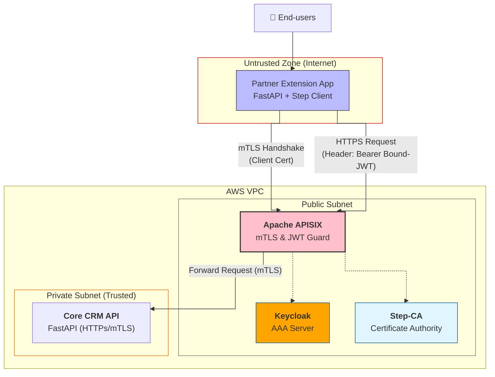
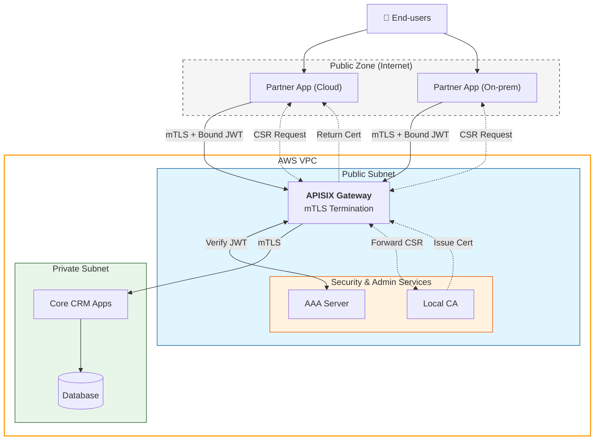

# Đề xuất 5: Kiến trúc Zero Trust cho Hệ sinh thái Ứng dụng mở rộng trên môi trường Hybrid Cloud

## 1. Giới thiệu

Trong lộ trình phát triển của Nền tảng CRM, chúng ta đang chuyển dịch từ mô hình "Internal Monolith" sang **"Hybrid Cloud"**. Trong mô hình này, các chức năng/ứng dụng mở rộng không còn bắt buộc phải chạy trong hạ tầng mạng nội bộ của doanh nghiệp. Thay vào đó, chúng có thể được phát triển và vận hành bởi:

- **Các đối tác chiến lược (Partners):** Chạy trên hạ tầng Cloud riêng của họ (AWS, GCP, Azure).
- **Khách hàng doanh nghiệp:** Chạy trên server On-premise để kiểm soát dữ liệu.
- **Remote Developers:** Chạy trên môi trường internet công cộng.

**Thách thức bảo mật:**
Việc mở rộng này đồng nghĩa với việc giao tiếp giữa Extension App và Core CRM phải đi qua **Internet công cộng (Public Internet)** - một môi trường "thù địch" chứa đầy rủi ro:

- Nguy cơ nghe lén (Man-in-the-Middle).
- Giả mạo định danh (Spoofing) và tấn công từ chối dịch vụ (DDoS) vào API Public.
- IP động không thể whitelist.

Do đó, các biện pháp bảo mật truyền thống như IP Whitelist hay chỉ dùng Token là không còn đủ. Đề xuất này xây dựng kiến trúc **Zero Trust** dựa trên **mTLS (Mutual TLS)** bắt buộc tại lớp biên để giải quyết các vấn đề trên.

## 2. Kiến trúc triển khai

Phần này mô tả chi tiết các thành phần công nghệ cụ thể sẽ được sử dụng để xây dựng và kiểm chứng mô hình (PoC).

### 2.1. Các bề mặt tấn công (Attack Surfaces)

Khi Core CRM mở API ra Internet, chúng ta đối mặt với các bề mặt tấn công sau:

1.  **Public Internet Ingress:** Cổng vào API Gateway tiếp xúc trực tiếp với Internet, dễ bị scan, tấn công DDoS hoặc khai thác lỗ hổng TLS.
2.  **Stolen User Credentials (JWT):** Token của người dùng bị lộ lọt do mã độc trên máy client hoặc bị bắt gói tin.
3.  **Compromised Partner Host:** Server của đối tác bị hack, hacker dùng server đó làm bàn đạp tấn công.

### 2.2. Công nghệ sử dụng

- **API Gateway:** **Apache APISIX** (đặt tại Public Subnet). Đóng vai trò là điểm cuối mTLS (mTLS Termination) và xác thực JWT.
- **AAA Server:** **Keycloak** (đặt tại Public Subnet). Quản lý danh tính người dùng và cấp phát Access Token; vẫn được bảo vệ bởi APISIX Routes.
- **PKI Infrastructure:** **Smallstep/Step-CA** (đặt tại Public Subnet). Quản lý cấp phát chứng chỉ cho Partner; vẫn được bảo vệ bởi APISIX Routes.
- **Core Services:** **FastAPI Application**. Chứa logic lõi, chạy trong Private Subnet. Chỉ chấp nhận kết nối mTLS từ APISIX.
- **Extension Apps:** **FastAPI Application**. Chạy giả lập trên môi trường bên ngoài, đại diện cho Partner App.
- **Security Protocol:**
  - **mTLS (Mutual TLS) - Frontend:** Xác thực giữa Partner App và APISIX.
  - **mTLS (Mutual TLS) - Backend:** Xác thực giữa APISIX và Core CRM App để đảm bảo Zero Trust nội bộ.
  - **JWT (JSON Web Token):** Xác thực quyền người dùng, được **bind** với Certificate của Partner (Sender Constrained).

### 2.3. Sơ đồ kiến trúc triển khai

## 3. Kiến trúc hệ thống

Kiến trúc tổng thể được chia thành các lớp chức năng rõ ràng để đảm bảo nguyên lý Bảo mật nhiều lớp, phân tách rõ ràng giữa môi trường Public và Private trên AWS.

Sơ đồ kiến trúc (Mermaid)

1.  **Lớp Đối tác:**

    - Bao gồm các hệ thống bên ngoài đa dạng (Cloud, On-prem).
    - Mỗi đối tác được cấp một **Digital Identity** (Chứng thư số - Client Certificate) duy nhất. Đây là "giấy thông hành" để bước tới cổng nhà chúng ta.

2.  **Lớp Biên & Bảo mật (Public Subnet):**

    - **Thành phần chính:** API Gateway, Keycloak, Step-CA.
    - **Nhiệm vụ:**
      - **mTLS Termination:** Chặn tất cả kết nối không có Client Certificate hợp lệ ngay từ tầng Transport.
      - **Identity & Access:** Keycloak quản lý user và cấp token. Step-CA quản lý chứng chỉ. Mặc dù nằm ở Public Subnet, các service này vẫn nên được truy cập thông qua APISIX để thống nhất chính sách bảo mật.

3.  **Lớp Lõi (Private Subnet):**
    - **Thành phần chính:** Microservices (CRM App), Databases.
    - **Nhiệm vụ:**
      - Chỉ xử lý các yêu cầu đến từ APISIX thông qua kênh **mTLS**.
      - Thực hiện **xác thực lại JWT** (Defense in Depth) để đảm bảo token hợp lệ và đúng là token dành cho Partner đang gọi.

## 4. Use-cases chi tiết

### 4.1. UC-01: Truy cập an toàn từ đối tác

- **Mô tả:** Partner Extension App gọi API lấy dữ liệu khách hàng từ Core CRM.
- **Luồng xử lý:**
  1.  Partner App khởi tạo kết nối TLS tới APISIX.
  2.  APISIX yêu cầu Client Certificate. Partner App gửi chứng chỉ hợp lệ.
  3.  APISIX kiểm tra chứng chỉ (CA, Expiry, Revocation). (Nếu sai -> Ngắt kết nối).
  4.  Nếu mTLS OK, APISIX đọc HTTP Header `Authorization: Bearer <token>`.
  5.  APISIX xác thực Token với Keycloak (Introspection) và kiểm tra xem Token này có **bind** với Client Certificate hiện tại không (ví dụ: check claim `cnf` hoặc `client_id` khớp với `CN` trong cert).
  6.  Nếu hợp lệ, APISIX khởi tạo kết nối **mTLS** tới Core CRM và chuyển tiếp request.
  7.  **Core CRM** nhận request, validate mTLS từ APISIX, và tiếp tục **validate JWT** một lần nữa (signature, audience) để đảm bảo Zero Trust tuyệt đối.

### 4.2. UC-02: Ràng buộc ngữ cảnh người dùng & Partner (Certificate Binding)

- **Mô tả:** Đảm bảo JWT chỉ có thể được sử dụng bởi đúng Partner đã được cấp chứng chỉ (Sender Constrained Token).
- **Luồng xử lý:**
  1.  Khi User đăng nhập qua Partner App, Partner App gửi request lấy token kèm theo thông tin Client Certificate của mình.
  2.  Keycloak cấp phát JWT, trong đó có chứa thông tin định danh của Partner (ví dụ hash của cert hoặc `client_id` của partner) vào trong token (claim `绑定` hoặc `cnf`).
  3.  Khi Partner App dùng Token này gọi API:
      - APISIX trích xuất thông tin từ Client Cert đang kết nối (Layer 4).
      - APISIX/CRM App giải mã JWT (Layer 7) và so sánh thông tin định danh Partner trong Token với thông tin từ Client Cert.
      - Nếu không khớp (ví dụ: Hacker trộm token của User từ Partner A nhưng đem sang máy Partner B hoặc máy cá nhân để dùng), request bị từ chối.

### 4.3. UC-03: Quản lý định danh tự động (Automated Identity Management)

- **Mô tả:** Tự động hóa hoàn toàn vòng đời chứng chỉ để giảm thiểu rủi ro vận hành và lộ lọt khóa.
- **Luồng xử lý:**
  1.  **Giai đoạn Bootstrapping:**
      - Extension App dùng One-time Token gọi qua APISIX vào Step-CA (đang ở Public Subnet nhưng route qua APISIX) để lấy chứng chỉ.
  2.  **Giai đoạn Vận hành:**
      - App chạy ngầm service kiểm tra hạn chứng chỉ.
  3.  **Giai đoạn Xoay vòng:**
      - App gọi APISIX -> Step-CA để renew chứng chỉ trước khi hết hạn.

## 5. Mô phỏng tấn công & Ngăn chặn

### Kịch bản 1: Đối tác giả mạo

- **Kết quả phòng thủ:** APISIX từ chối bắt tay SSL (**TLS Handshake Failure**).

### Kịch bản 2: Tấn công phát lại Token (Replay Attack)

- **Tấn công:** Hacker trộm JWT hợp lệ và thử replay từ máy cá nhân hoặc server khác.
- **Kết quả phòng thủ:**
  - **Lớp 1 (mTLS):** Hacker không có Client Cert hợp lệ -> Rớt ngay tại cổng APISIX.
  - **Lớp 2 (Binding Check):** Giả sử Hacker có một Client Cert hợp lệ của _Partner B_ (thông đồng), nhưng lại dùng Token trộm được từ _Partner A_.
    - APISIX/CRM check thấy: `Token.issued_for = Partner A` nhưng `TLS.client_cert = Partner B`.
    - -> **Phát hiện bất thường và Chặn**.

## 6. Đánh giá

| Tiêu chí                | Mô hình cũ (Private Auth)       | Mô hình mới (Public Auth + Binding)                 |
| :---------------------- | :------------------------------ | :-------------------------------------------------- |
| **Vị trí Auth Service** | Private (An toàn, khó tiếp cận) | **Public** (Linh hoạt, dễ tích hợp Extension)       |
| **Bảo mật Nội bộ**      | HTTP (Tin tưởng mạng LAN)       | **mTLS** (Zero Trust hoàn toàn giữa Gateway & App)  |
| **Ràng buộc Token**     | Không/Yếu                       | **Mạnh** (Token gắn chết với Certificate người gọi) |
| **Độ phức tạp**         | Trung bình                      | **Cao** (Cấu hình mTLS 2 đầu, Custom Token Claims)  |

## 7. Kết luận

Kiến trúc mới không chỉ mở rộng khả năng tích hợp (đưa Auth/CA ra Public Subnet) mà còn siết chặt bảo mật lên mức cao nhất bằng cách áp dụng **mTLS end-to-end** (từ App đến Gateway và từ Gateway đến Core) và cơ chế **Sender Constrained Token**. Điều này đảm bảo rằng dù các thành phần quan trọng nằm ở vùng mạng Public, chúng vẫn được bảo vệ bởi lớp vỏ định danh số học không thể giả mạo.
