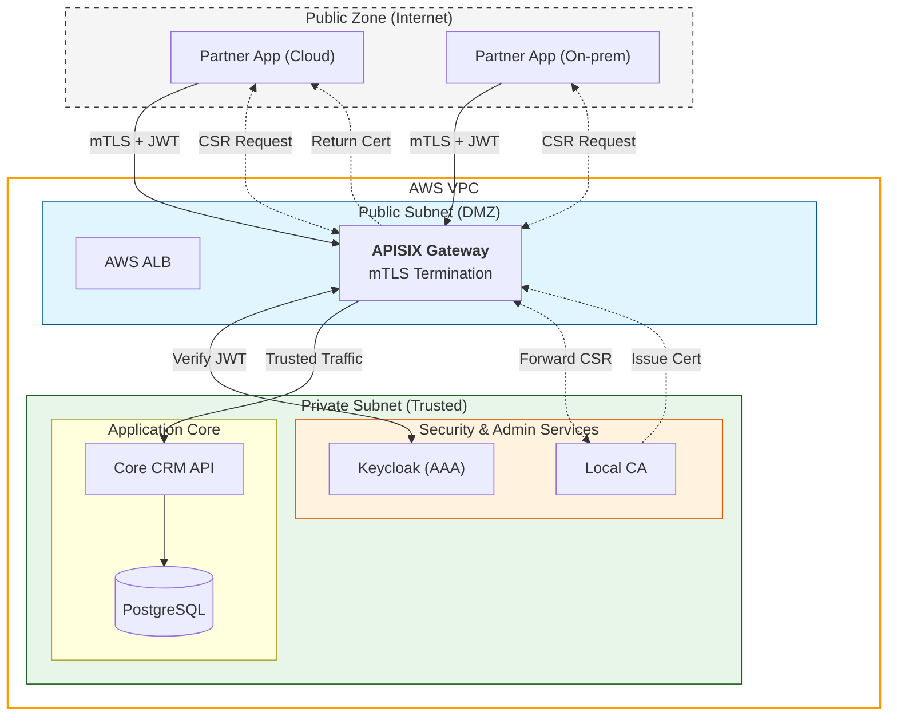

# Đề xuất 5: Kiến trúc Zero Trust cho Hệ sinh thái Ứng dụng mở rộng trên môi trường Hybrid Cloud

## 1. Giới thiệu

Trong lộ trình phát triển của Nền tảng CRM, chúng ta đang chuyển dịch từ mô hình "Internal Monolith" sang **"Hybrid Cloud"**. Trong mô hình này, các chức năng/ứng dụng mở rộng không còn bắt buộc phải chạy trong hạ tầng mạng nội bộ của doanh nghiệp. Thay vào đó, chúng có thể được phát triển và vận hành bởi:

- **Các đối tác chiến lược (Partners):** Chạy trên hạ tầng Cloud riêng của họ (AWS, GCP, Azure).
- **Khách hàng doanh nghiệp:** Chạy trên server On-premise để kiểm soát dữ liệu.
- **Remote Developers:** Chạy trên môi trường internet công cộng.

**Thách thức bảo mật:**
Việc mở rộng này đồng nghĩa với việc giao tiếp giữa Extension App và Core CRM phải đi qua **Internet công cộng (Public Internet)** - một môi trường "thù địch" chứa đầy rủi ro:

- Nguy cơ nghe lén (Man-in-the-Middle).
- Giả mạo định danh (Spoofing) và tấn công từ chối dịch vụ (DDoS) vào API Public.
- IP động không thể whitelist.

Do đó, các biện pháp bảo mật truyền thống như IP Whitelist hay chỉ dùng Token là không còn đủ. Đề xuất này xây dựng kiến trúc **Zero Trust** dựa trên **mTLS (Mutual TLS)** bắt buộc tại lớp biên để giải quyết các vấn đề trên.

## 2. Kiến trúc triển khai

Phần này mô tả chi tiết các thành phần công nghệ cụ thể sẽ được sử dụng để xây dựng và kiểm chứng mô hình (PoC).

### 2.1. Các bề mặt tấn công (Attack Surfaces)

Khi Core CRM mở API ra Internet, chúng ta đối mặt với các bề mặt tấn công sau:

1.  **Public Internet Ingress:** Cổng vào API Gateway tiếp xúc trực tiếp với Internet, dễ bị scan, tấn công DDoS hoặc khai thác lỗ hổng TLS.
2.  **Stolen User Credentials (JWT):** Token của người dùng bị lộ lọt do mã độc trên máy client hoặc bị bắt gói tin.
3.  **Compromised Partner Host:** Server của đối tác bị hack, hacker dùng server đó làm bàn đạp tấn công.

### 2.2. Công nghệ sử dụng

- **API Gateway:** **Apache APISIX** (đặt tại Public Subnet). Đóng vai trò là điểm cuối mTLS (mTLS Termination) và xác thực JWT.
- **AAA Server:** **Keycloak**. Quản lý danh tính người dùng và cấp phát Access Token.
- **Core Services:** **FastAPI Application**. Chứa logic lõi, chạy trong Private Subnet, không public ra ngoài.
- **Extension Apps:** **FastAPI Application**. Chạy giả lập trên môi trường bên ngoài (bên ngoài Docker Network nội bộ hoặc từ host machine), đại diện cho Partner App.
- **Security Protocol:**
  - **mTLS (Mutual TLS):** Xác thực định danh hai chiều giữa Partner App và APISIX Gateway.
  - **JWT (JSON Web Token):** Xác thực quyền của người dùng cuối (End-user context).

### 2.3. Sơ đồ kiến trúc triển khai


## 3. Kiến trúc hệ thống

Kiến trúc tổng thể được chia thành các lớp chức năng rõ ràng để đảm bảo nguyên lý Bảo mật nhiều lớp, phân tách rõ ràng giữa môi trường Public và Private trên AWS.

<details>
<summary>Sơ đồ kiến trúc (Mermaid)</summary>



</details>

1.  **Lớp Đối tác:**

    - Bao gồm các hệ thống bên ngoài đa dạng (Cloud, On-prem).
    - Mỗi đối tác được cấp một **Digital Identity** (Chứng thư số - Client Certificate) duy nhất. Đây là "giấy thông hành" để bước tới cổng nhà chúng ta.

2.  **Lớp Biên & Bảo mật:**

    - **Thành phần chính:** API Gateway & Web Application Firewall (WAF).
    - **Nhiệm vụ:**
      - **mTLS Termination:** Chặn tất cả kết nối không có Client Certificate hợp lệ ngay từ tầng Transport (Lớp 4).
      - **CA Proxy (Registration Authority):** Nhận yêu cầu CSR từ đối tác bên ngoài và chuyển tiếp an toàn vào Local CA nội bộ.

3.  **Lớp Định danh & Ủy quyền:**

    - **Thành phần chính:** AAA Server (Keycloak) và **Local CA**.
    - **Nhiệm vụ:** Local CA quản lý vòng đời chứng chỉ nhưng hoàn toàn biệt lập với Internet, chỉ giao tiếp qua Proxy.

4.  **Lớp Lõi:**
    - **Thành phần chính:** Microservices, Databases.
    - **Nhiệm vụ:** Chỉ xử lý các yêu cầu đã được "lọc sạch" qua 2 lớp bảo vệ (mTLS + JWT).

## 4. Use-cases chi tiết

### 4.1. UC-01: Truy cập an toàn từ đối tác

- **Mô tả:** Partner Extension App gọi API lấy dữ liệu khách hàng từ Core CRM.
- **Luồng xử lý:**
  1.  Partner App khởi tạo kết nối TLS tới APISIX.
  2.  APISIX yêu cầu Client Certificate. Partner App gửi chứng chỉ hợp lệ.
  3.  APISIX kiểm tra chứng chỉ có được ký bởi **Local CA** tin cậy không và còn hạn không. (Nếu sai -> Ngắt kết nối).
  4.  Nếu mTLS OK, APISIX đọc HTTP Header `Authorization: Bearer <token>`.
  5.  APISIX xác thực Token với Keycloak (Signature, Expiry).
  6.  Nếu Token OK, request được chuyển tiếp vào Core CRM.

### 4.2. UC-02: Ràng buộc ngữ cảnh người dùng

- **Mô tả:** Đảm bảo Extension App không thể tự ý hành động nếu không có sự cho phép của User.
- **Luồng xử lý:**
  1.  User đăng nhập trên giao diện Extension App -> nhận JWT từ Keycloak.
  2.  Extension App dùng JWT đó để đại diện cho User gọi xuống Core CRM.
  3.  Core CRM nhận diện được: "Đây là request từ Partner A (qua mTLS), thực hiện bởi User B (qua JWT)".

### 4.3. UC-03: Quản lý định danh tự động (Automated Identity Management)

- **Mô tả:** Tự động hóa hoàn toàn vòng đời chứng chỉ để giảm thiểu rủi ro vận hành và lộ lọt khóa.
- **Luồng xử lý:**
  1.  **Giai đoạn Bootstrapping (Cấp phát lần đầu):**
      - Extension App được cấp một **One-time Token** (hoặc Provisioner Key) an toàn khi khởi tạo (qua CI/CD).
      - App tự sinh cặp Private/Public Key nội bộ (không bao giờ truyền đi).
      - App tạo một yêu cầu ký chứng chỉ (**CSR**) gửi tới Local CA kèm theo Token đã được cấp.
      - Local CA xác thực Token, ký CSR và trả về Certificate (.crt) cho App.
  2.  **Giai đoạn Vận hành (Monitoring):**
      - Một tiến trình Agent chạy ngầm trong App định kỳ kiểm tra thời hạn của Certificate hiện tại.
  3.  **Giai đoạn Xoay vòng (Rotation):**
      - Khi thời hạn còn dưới 20% (ví dụ: còn 1 tiếng trên tổng 5 tiếng), Agent gửi yêu cầu gia hạn (**Renewal**) tới Local CA.
      - Vì App đang sở hữu chứng chỉ cũ hợp lệ, Local CA sử dụng chính chứng chỉ đó để xác thực yêu cầu gia hạn (Mutual Auth).
      - Local CA cấp chứng chỉ mới với thời hạn mới.
      - App tự động nạp (hot-reload) chứng chỉ mới mà không cần khởi động lại.

## 5. Mô phỏng tấn công & Ngăn chặn

Dưới đây là 2 kịch bản tấn công điển hình và cách hệ thống phòng thủ:

### Kịch bản 1: Đối tác giả mạo

- **Tấn công:** Hacker biết địa chỉ API public (`https://api.crm.com`). Hacker dùng `curl` hoặc tool tấn công web để gửi request dò tìm lỗ hổng hoặc spam dữ liệu.

```bash
curl -X POST https://api.crm.com/api/v1/customers
```

- **Kết quả phòng thủ:**
  - Do Hacker không có Private Key/Certificate hợp lệ (chưa được cấp phát).
  - APISIX từ chối bắt tay SSL (**TLS Handshake Failure**).
  - Kết nối bị ngắt ngay lập tức. Request HTTP thậm chí còn không được gửi đi. Hacker không thể khai thác lỗ hổng SQL Injection hay XSS vì không chạm được vào tầng ứng dụng.

### Kịch bản 2: Tấn công phát lại Token

- **Tấn công:**
  - Hacker cài phần mềm nghe lén (hoặc đứng sau lưng nhân viên) và chụp được chuỗi **Access Token (JWT)** hợp lệ của một quản lý cấp cao.
  - Hacker mang Token về máy cá nhân, dùng Postman để gửi request xóa dữ liệu, giả danh quản lý đó.
- **Kết quả phòng thủ:**
  - Máy cá nhân của Hacker kết nối tới APISIX.
  - APISIX yêu cầu Client Certificate (mTLS).
  - Hacker **không có** Certificate (vì Certificate file được lưu bảo mật trên server của Partner hoặc trong thiết bị bảo mật, Hacker chỉ trộm được Token string).
  - Kết nối thất bại. Token dù hợp lệ (còn hạn, đúng chữ ký) cũng trở nên vô dụng vì kẻ gửi nó không có "Phương tiện vận chuyển tin cậy" (Authenticated Channel).

## 6. Đánh giá

So sánh kiến trúc Hybrid mTLS này với các mô hình phổ biến khác:

| Tiêu chí                  | Mô hình truyền thống (IP Whitelist) | Mô hình API Key / Token thường | Mô hình đề xuất (Zero Trust mTLS)                    |
| :------------------------ | :---------------------------------- | :----------------------------- | :--------------------------------------------------- |
| **Chống giả mạo IP**      | Thấp (Dễ bị IP Spoofing)            | Thấp                           | **Cao** (Dùng Cryptographic Identity)                |
| **Bảo mật đường truyền**  | Phụ thuộc VPN                       | Dựa vào server HTTPS một chiều | **Cao nhất** (Mã hóa & Xác thực 2 chiều)             |
| **Chống Replay Attack**   | Thấp                                | Thấp                           | **Trung bình - Cao** (Token gắn với kênh bảo mật)    |
| **Vận hành (Complexity)** | Đơn giản                            | Đơn giản                       | **Phức tạp** (Cần quản lý CA, cấp phát/thu hồi Cert) |
| **Phù hợp Internet**      | Kém (IP động khó quản)              | Tốt                            | **Rất tốt** (Không phụ thuộc mạng/IP)                |

## 7. Kết luận

Với mô hình **Hybrid Extension Ecosystem**, việc chuyển sang kiến trúc sử dụng **mTLS** tại lớp biên (Edge) kết hợp với **JWT** là bước đi chiến lược cần thiết. Nó chuyển đổi trạng thái bảo mật từ Network Trust sang Identity Trust.

Mặc dù có chi phí vận hành cao hơn trong việc quản lý chứng chỉ số, nhưng đổi lại, hệ thống đạt được khả năng phòng thủ chiều sâu (Defense in Depth) mạnh mẽ trước các mối đe dọa từ Internet, đặc biệt là khả năng vô hiệu hóa các cuộc tấn công giả mạo và lạm dụng Token.
